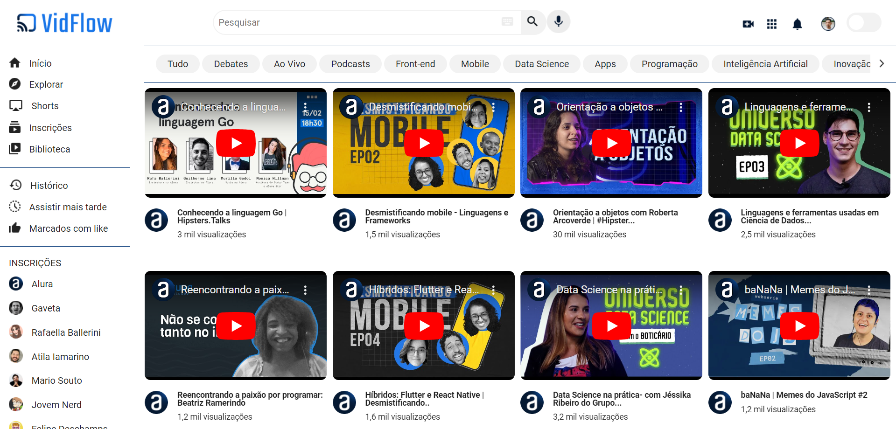

# Video Flow

## Descrição do Projeto 

O Projeto VideoFlow é uma página de vídeos inspirada no YouTube, projetada para proporcionar uma experiência de navegação agradável para os usuários.

## Funcionalidades do projeto

* Reprodução de vídeos diretamente na página.
* Barra de pesquisa para encontrar vídeos específicos. Possui layout responsivo.
* Design responsivo para se adaptar a diferentes dispositivos.

## Técnicas e tecnologias utilizadas

* HTML
* CSS
* Javascript
* Node.js
* NPM
* Os pacotes ESLint, Prettier, JSON Server, Axios e Vite
* Vercel

# Acesso ao Projeto

[Acesse meu projeto](https://videoflow.vercel.app/).

